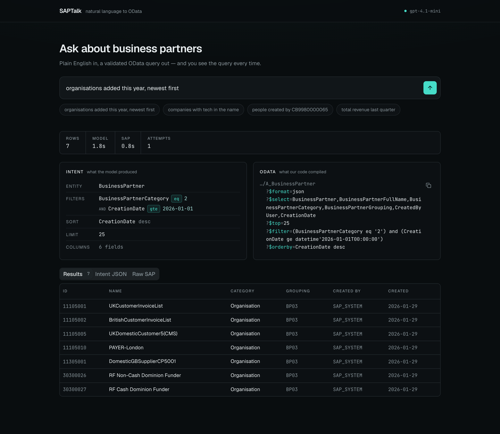
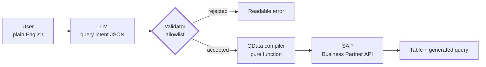

# SAPTalk

[](https://github.com/dinalUdagedara/SAPTalk/actions/workflows/ci.yml)

**Ask questions about SAP business data in plain English.**

An LLM translates the question into a structured *query intent*. It never writes OData.
Deterministic, testable code validates that intent against a field allowlist and compiles
it into a valid OData query — and the generated query is always shown to the user.



---

## Why this design

The obvious approach is to ask a model for an OData URL and run it. That demos well and is
a bad idea in a real system: **if the model writes the query string, the model's output is
the thing you execute.** There is no point at which you can meaningfully validate it — you
end up pattern-matching a URL and hoping you thought of everything.

SAPTalk puts a wall in the middle. The model fills in a schema; it never produces a query.



Everything after the validator is ordinary TypeScript with no AI in it. That boundary buys
four things:

| | |
|---|---|
| **A field allowlist the model cannot escape** | An intent naming an unknown field is rejected before anything is built. There is no string for a prompt injection to smuggle syntax through. |
| **Enforceable limits** | Row caps, permitted operators and sort fields are checked on a plain object, not regex-matched out of a URL after the fact. |
| **Testability without the model** | The compiler is a pure function from intent to query string — unit testable exhaustively, with no API key and no nondeterminism. |
| **A swappable model** | The LLM's only contract is a JSON shape. Changing provider, or falling back to keyword parsing, touches nothing downstream. |

An intent looks like this:

```jsonc
{
  "entity": "BusinessPartner",
  "select": ["BusinessPartner", "BusinessPartnerFullName", "CreationDate"],
  "filters": [
    { "field": "BusinessPartnerCategory", "op": "eq",  "value": "2" },
    { "field": "CreationDate",            "op": "gte", "value": "2026-01-01" }
  ],
  "orderBy": [{ "field": "CreationDate", "direction": "desc" }],
  "top": 25
}
```

---

## Status

All five milestones complete. Ask a question in plain English and the answer comes back with
the intent the model produced and the OData compiled from it, side by side.

| | Milestone | State |
|---|---|---|
| 1 | End-to-end pipe — button → API → SAP → table | ✅ Done |
| 2 | Query intent schema (Zod) in `packages/shared` | ✅ Done |
| 3 | Intent → OData compiler, unit tested | ✅ Done |
| 4 | LLM layer via structured outputs | ✅ Done |
| 5 | UI — intent shown beside the generated query | ✅ Done |

The model layer was deliberately built last. By the time the schema and compiler existed, it
was the easy part.

---

## The sandbox speaks OData V2, not V4

`API_BUSINESS_PARTNER` on the SAP Business Accelerator Hub is **OData V2**. Most OData
documentation — and most of what an LLM will confidently produce — is V4. Every row below
is a place where the obvious code fails silently or not at all.

| Concern | V2 (what we have) | V4 (what docs show) |
|---|---|---|
| Response shape | `{ d: { results: [] } }` | `{ value: [] }` |
| JSON output | `$format=json` required | default |
| Total count | `$inlinecount=allpages` → `d.__count` | `$count=true` |
| Dates | `/Date(1700000000000)/` | ISO-8601 |
| **Substring match** | **`substringof('x', Field)`** | **`contains(Field, 'x')`** |
| Auth header | `APIKey: <key>` | — |

The highlighted row matters most: *"companies with 'Tech' in the name"* is the most common
natural-language filter and the one whose syntax differs.

These were **confirmed against the live sandbox**, not inferred:

```
substringof('tech',BusinessPartnerFullName)             → 200 ✅
BusinessPartnerCategory eq '1'                          → 200 ✅
CreationDate ge datetime'2025-01-01T00:00:00'           → 200 ✅
contains(BusinessPartnerFullName,'tech')                → 400 ❌
    "Property contains not found in type A_BusinessPartnerType"
```

Response unwrapping and EDM date parsing are handled in
[`apps/api/src/sap/odata-v2.ts`](apps/api/src/sap/odata-v2.ts).

---

## Getting started

**Requires** Node 22+ and pnpm 10+. CI runs the test suite on Node 22 and 24; 24 is what this is developed against.

1. **Get a sandbox API key** — [api.sap.com](https://api.sap.com) → avatar → Settings →
   *Show API Key*. One key covers the whole Business Accelerator Hub sandbox.

2. **Configure the backend**

   ```bash
   cp .env.example apps/api/.env
   # paste your key into SAP_API_KEY
   ```

3. **Configure the frontend** *(optional — defaults to `http://localhost:3001/api`)*

   ```bash
   cp apps/web/.env.local.example apps/web/.env.local
   ```

4. **Install and run**

   ```bash
   pnpm install
   pnpm dev
   ```

Open <http://localhost:3000> and click **Fetch business partners**.

> **Getting a 401?** The key is missing or wrong — SAP replies
> `Failed to resolve API Key variable request.header.apikey`. A 404 would mean the URL is
> wrong instead; the base URL in `.env.example` is verified against the live sandbox.

### Checks

```bash
pnpm test        # 52 tests, no API key or network needed
pnpm typecheck
pnpm build
```

The schema and compiler are pure, so the interesting half of the system is tested with no
API key, no network and no model. CI runs all three on every pull request.

### API

```http
POST /api/ask                             # ask a question in plain English
POST /api/sap/query                       # run a query intent directly
GET  /api/sap/business-partners?top=10    # unfiltered first page
```

```bash
curl -X POST localhost:3001/api/ask -H 'Content-Type: application/json' \
  -d '{ "question": "organisations added this year, newest first" }'
```

Both return a `QueryEnvelope`: the resolved SAP URL, upstream duration, normalised rows, and
the untouched raw payload.

`POST /api/sap/query` takes an intent, validates it against the field allowlist, compiles it
to OData and runs it. A rejected intent returns 400 with the specific reasons.

```bash
curl -X POST localhost:3001/api/sap/query -H 'Content-Type: application/json' -d '{
  "entity": "BusinessPartner",
  "filters": [{ "field": "BusinessPartnerFullName", "op": "contains", "value": "Steel" }],
  "orderBy": [{ "field": "CreationDate", "direction": "desc" }],
  "top": 5
}'
```

---

## Project structure

A single pnpm workspace. One repo, because the query intent schema is imported by the model
prompt, the backend validator and the frontend renderer — three consumers, one definition.

```
apps/api/                        NestJS backend, port 3001
  src/sap/
    sap.service.ts               transport: builds URLs, calls SAP, maps errors
    business-partner.service.ts  entity logic: projection + normalisation
    sap.controller.ts            HTTP surface
    intent-compiler.ts           intent -> OData V2 params, a pure function
    odata-v2.ts                  V2 dialect helpers
apps/web/                        Next.js frontend, port 3000
  src/app/page.tsx               composes the whole view
  src/components/
    ask-bar.tsx                  the question input
    intent-panel.tsx             what the model decided
    query-panel.tsx              the OData our code built
    results-table.tsx            rows from SAP
    empty-state.tsx              the pipeline, before the first question
    ui/                          shadcn/ui primitives
  src/lib/api.ts                 typed client
packages/shared/                 types imported by both
  src/api.ts                     QueryEnvelope
  src/business-partner.ts        normalised row shape
  src/query-intent/              the validation boundary
    fields.ts                    the field allowlist
    operators.ts                 operator vocabulary, dialect-independent
    intent.ts                    Zod schema + registry cross-checks
docs/
  SAPTalk-Explained.docx         concept explainer, no SAP background assumed
```

`SapService` deliberately knows nothing about Business Partners — it takes an entity set and
a parameter map. The intent compiler will produce exactly that map, so it slots in without
the transport layer changing.

---

## Data notes

The sandbox holds **7,690 Business Partner records** — 59% organisations, 41% people, eight
grouping codes, creation dates spread across 2016–2026. Filtering, name search, date ranges
and sorting all have real data behind them.

It holds no transactional data, though. This entity has no orders and no revenue, so
*"top customers by revenue last quarter"* cannot be answered regardless of row count —
that needs a second API, not more rows.

---

## Tech stack

| Layer | Choice | Why |
|---|---|---|
| Backend | NestJS | One language means the intent schema is defined once and reused by the model prompt, the validator and the UI. FastAPI would mean a Pydantic model plus a hand-mirrored TS type that drifts. |
| Frontend | Next.js, TypeScript, Tailwind v4, shadcn/ui | Dark console UI. The intent and the compiled query sit side by side, because seeing both together is the product's argument. |
| Validation | Zod *(milestone 2)* | Same schema constrains the model's structured output and validates the request. |
| Data | SAP Business Accelerator Hub sandbox | Free, realistic, no real financial data. |
| HTTP | Native `fetch` | Node 24 ships it; `AbortSignal.timeout()` covers timeouts. No client library needed. |

---

## License

MIT — see [LICENSE](LICENSE).
